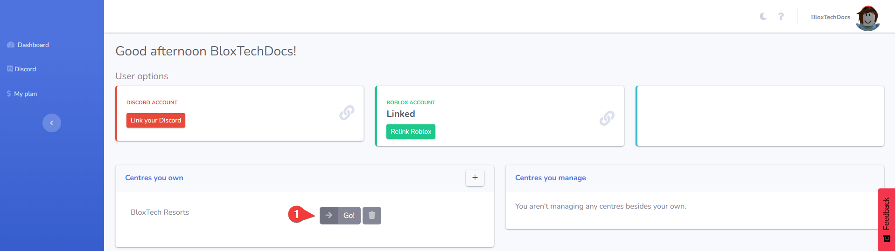

# Publishing on Roblox



### Navigate to your centre page

[Click here](https://bloxtech.tech/admin/applications/) to open your BloxTech dashboard. Log in if you haven't already. Find your centre in the list and press on <kbd>Go!</kbd>

<figure><figcaption></figcaption></figure>



### Download your centre file

Click on the blue <kbd><mark style="color:blue;">Download<mark style="color:blue;"></kbd> button.

<figure><figcaption></figcaption></figure>

This will open a selection panel. You can learn more about the centre types [here](choosing-the-right-type.md). For this tutorial, we'll use the **Application Centre**, but the same steps apply to the Interview Centre.

<figure><figcaption></figcaption></figure>


Some browsers (such as Safari and Internet Explorer) may have issues with downloading the centre file. Try a compatible browser like [Chrome](https://www.google.com/chrome/) or [Firefox](https://www.mozilla.org/en-US/firefox/new/) if you experience any problems.




### Open your file in Roblox Studio

This requires you to install Roblox Studio if you haven't already:\
[https://www.roblox.com/download/studio](https://www.roblox.com/download/studio)

Then, find the **Downloads** folder of your device.&#x20;

For Windows, you can open the Explorer application, select **Downloads** on the left side and double-click on **BloxTech-Applications.rbxlx**.

<figure><figcaption></figcaption></figure>



### Publish your game

When Roblox Studio has loaded the place file, you should see a black screen with white text. In the left upper corner of the screen, click on <kbd>FILE</kbd> . Then, press on **Publish to Roblox As**.

<figure><figcaption></figcaption></figure>

This will open a new window with a list of games. Click on **Create new game**.

<figure><figcaption></figcaption></figure>

Enter your game name, description and don't forget to select your group. Then, select <kbd><mark style="color:blue;">Create<mark style="color:blue;"></kbd> . After it has been published successfully, press <kbd>Close</kbd> .

<figure><figcaption></figcaption></figure>



### Enable Third-Party Teleports

To avoid your centre getting stuck on a loading screen, you will have to enable Third-Party Teleports. To do that, press on **Game Settings**.

<figure><figcaption></figcaption></figure>

In the settings panel that opens, click on **Security**, scroll down and switch the toggle for **Allow Third Party Teleports**. Click on **Save** to confirm.

<figure><figcaption></figcaption></figure>



### Make your game public

Open **Game Settings** again, go to the **Permissions** tab and select **Public**. Click on **Save** to confirm.

<figure><figcaption></figcaption></figure>



### You have published your application centre :tada:

You should now see your centre on your group under the **Experiences** section.

<figure><figcaption></figcaption></figure>



## Troubleshooting

If you don't see <strong>Experiences</strong> on your group page

You may have group game visibility turned off in your group settings. To fix this, click on the three dots and press **Configure community**.&#x20;

.png>)

Head over to the **Settings** tab and turn on **Community experiences are visible on the community home page**.

.png>)

You should now see your experiences on the group page!

